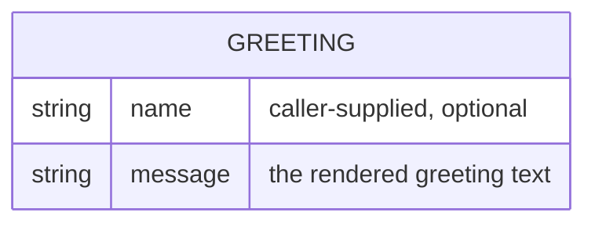

# Domain Model

greeter has one conceptual entity: the greeting it computes and returns for a given caller-supplied name. Nothing is persisted — the entity exists only for the duration of a single request/response.

